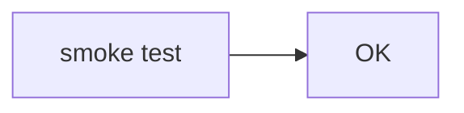
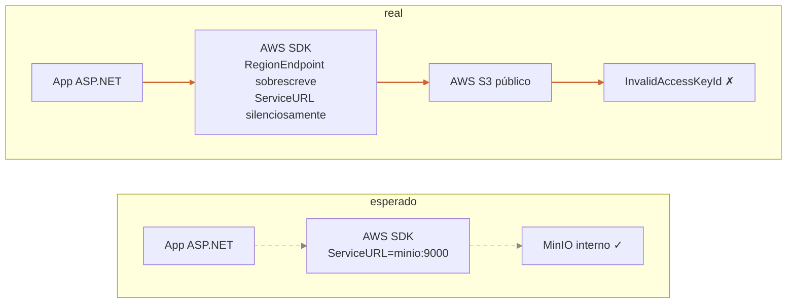
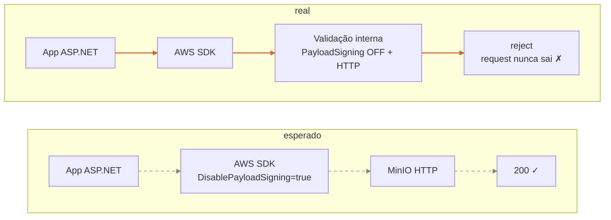
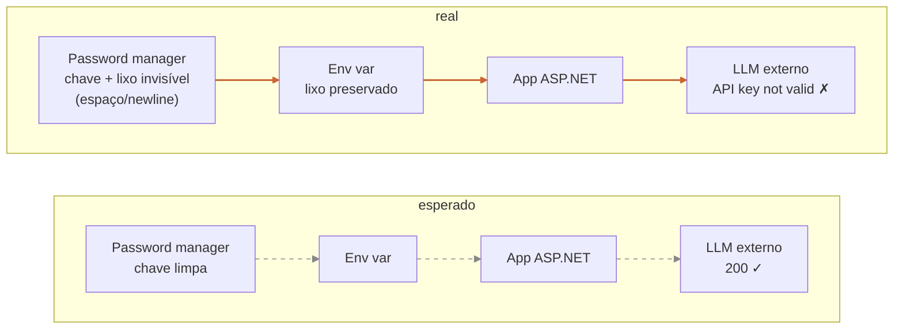
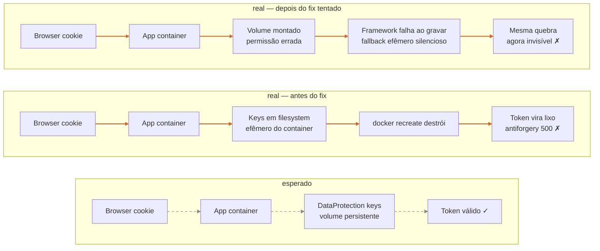

# Diagramas de Arquitetura no Post de Bugs em Prod — Plano de Implementação

> **For agentic workers:** REQUIRED SUB-SKILL: Use superpowers:subagent-driven-development (recommended) or superpowers:executing-plans to implement this plan task-by-task. Steps use checkbox (`- [ ]`) syntax for tracking.

**Goal:** Adicionar quatro diagramas Mermaid (esperado vs real) ao post `em-dev-funciona-nao-significa-nada.md`, um por seção de bug, renderizados em build-time como SVG inline.

**Architecture:** `rehype-mermaid` no pipeline markdown do Astro converte fenced code blocks ` ```mermaid ` em SVG durante o build (estratégia `inline-svg`, usando Playwright como dev-dep). Diagramas usam tema `base` com cores neutras (cinzas + accent quente) que funcionam em ambos os temas light/dark do site, sem necessidade de sincronização dinâmica via CSS.

**Tech Stack:** Astro 6, `rehype-mermaid`, `playwright` (dev only), Markdown.

**Spec:** `docs/superpowers/specs/2026-05-23-diagramas-arquitetura-post-bugs-design.md`

---

## Estrutura de Arquivos

- Modificar: `package.json` — adicionar devDependencies `rehype-mermaid`, `playwright`
- Modificar: `astro.config.mjs` — adicionar `rehype-mermaid` em `markdown.rehypePlugins`
- Modificar: `src/content/blog/em-dev-funciona-nao-significa-nada.md` — inserir 4 fenced blocks `mermaid` nas 4 seções `## Bug N`
- Modificar (opcional, só se necessário após inspeção visual): `src/styles/global.css` — overrides scopados para mermaid em dark mode

---

## Convenções dos diagramas

Para garantir consistência visual entre os 4 diagramas e legibilidade em ambos os temas:

- **Tema mermaid:** `base` (configurado em `astro.config.mjs`)
- **Direção:** `LR` (left-to-right) — diagramas verticais (`TB`) só quando explicitamente indicado
- **Caminho esperado:** seta pontilhada `-.->` + `linkStyle` cor `#888888` (cinza neutro, legível em ambos os temas) + `stroke-dasharray: 5 5`
- **Caminho real (falha):** seta sólida `==>` + `linkStyle` cor `#cc6633` (laranja queimado, contrasta em ambos os temas) + `stroke-width: 2px`
- **Marcador de falha terminal:** sufixo ` ✗` no label do nó final do caminho real
- **Marcador de sucesso terminal:** sufixo ` ✓` no label do nó final do caminho esperado
- **Agrupamento:** usar `subgraph esperado` e `subgraph real` para isolar os dois caminhos

---

## Task 1: Integrar rehype-mermaid no pipeline

**Files:**
- Modify: `package.json`
- Modify: `astro.config.mjs`
- Modify: `src/content/blog/em-dev-funciona-nao-significa-nada.md` (smoke test temporário)

- [ ] **Step 1: Instalar dependências**

Run:
```bash
npm install --save-dev rehype-mermaid playwright
npx playwright install chromium
```

Expected: `node_modules/rehype-mermaid/` e `node_modules/playwright/` instalados; Chromium baixado por Playwright (~150MB).

- [ ] **Step 2: Adicionar plugin ao astro.config.mjs**

Substituir o bloco `markdown:` atual em `astro.config.mjs` por:

```js
import rehypeMermaid from 'rehype-mermaid';

// ...dentro de defineConfig({...}):
  markdown: {
    shikiConfig: {
      themes: {
        light: 'github-light',
        dark: 'github-dark-dimmed',
      },
    },
    rehypePlugins: [
      [rehypeMermaid, {
        strategy: 'inline-svg',
        mermaidConfig: {
          theme: 'base',
          themeVariables: {
            fontFamily: 'IBM Plex Mono, ui-monospace, monospace',
            fontSize: '14px',
            primaryColor: '#f0f0ec',
            primaryTextColor: '#1a1a1a',
            primaryBorderColor: '#888888',
            lineColor: '#888888',
            secondaryColor: '#fafafa',
            tertiaryColor: '#fafafa',
          },
        },
      }],
    ],
  },
```

O `import` vai no topo do arquivo, junto com os outros imports.

- [ ] **Step 3: Adicionar smoke test no post**

No topo do conteúdo de `src/content/blog/em-dev-funciona-nao-significa-nada.md`, logo após a frontmatter (linha 5) e antes do parágrafo "Hoje passei a tarde...", inserir temporariamente:

````markdown

````

- [ ] **Step 4: Build e verificar renderização**

Run: `npm run build`

Expected:
- Build conclui sem erros
- Arquivo `dist/client/blog/em-dev-funciona-nao-significa-nada/index.html` (ou caminho equivalente) contém uma tag `<svg` proveniente do mermaid
- Verificar com: `grep -c "<svg" dist/client/blog/em-dev-funciona-nao-significa-nada/index.html` → deve ser ≥ 1

Se falhar com erro de Playwright, garantir que `npx playwright install chromium` rodou com sucesso.

- [ ] **Step 5: Inspeção visual rápida**

Run: `npm run dev` (em outro terminal)
Abrir `http://localhost:4321/blog/em-dev-funciona-nao-significa-nada/`
Confirmar visualmente: o diagrama "smoke test → OK" renderiza no topo do post.
Alternar tema (botão no header) e confirmar que o diagrama continua legível em ambos os temas.

Parar o `npm run dev` (Ctrl+C) após validar.

- [ ] **Step 6: Remover smoke test**

Remover o bloco ```mermaid de smoke test do post (a inserção feita no Step 3). O post volta ao estado anterior.

- [ ] **Step 7: Commit**

```bash
git add package.json package-lock.json astro.config.mjs
git commit -m "feat: integra rehype-mermaid no pipeline markdown"
```

---

## Task 2: Diagrama do Bug 1 (request indo pra nuvem errada)

**Files:**
- Modify: `src/content/blog/em-dev-funciona-nao-significa-nada.md`

- [ ] **Step 1: Inserir o diagrama**

No post, localizar o título `## Bug 1: o endpoint que apontava pro lugar errado` (linha 13).

Inserir, **imediatamente após o título** (entre o `## Bug 1: ...` e o parágrafo "O primeiro sintoma..."), uma linha em branco e o bloco:

````markdown

````

Seguido de uma linha em branco antes do parágrafo "O primeiro sintoma...".

- [ ] **Step 2: Build e verificar**

Run: `npm run build`
Expected: build sem erros; HTML do post contém ao menos uma tag `<svg`.

- [ ] **Step 3: Inspeção visual**

Run: `npm run dev`
Abrir o post no browser. Verificar:
- Diagrama aparece logo após o título do Bug 1
- Caminho "esperado" está pontilhado e cinza
- Caminho "real" está sólido e em laranja queimado
- Labels legíveis (sem texto cortado)
- Funciona em ambos os temas (toggle)

Parar `npm run dev`.

- [ ] **Step 4: Commit**

```bash
git add src/content/blog/em-dev-funciona-nao-significa-nada.md
git commit -m "feat: adiciona diagrama do Bug 1 (SDK indo pra AWS em vez de MinIO)"
```

---

## Task 3: Diagrama do Bug 2 (pipeline do SDK bloqueando antes de sair)

**Files:**
- Modify: `src/content/blog/em-dev-funciona-nao-significa-nada.md`

- [ ] **Step 1: Inserir o diagrama**

Localizar o título `## Bug 2: o fix que destravou o próximo bug`.

Inserir, **imediatamente após o título** (antes do parágrafo "Tentei o upload de novo. Erro novo:"), uma linha em branco e o bloco:

````markdown

````

Seguido de uma linha em branco antes do parágrafo seguinte.

- [ ] **Step 2: Build e verificar**

Run: `npm run build`
Expected: build sem erros; HTML do post agora contém ≥ 2 tags `<svg`.

- [ ] **Step 3: Inspeção visual**

Run: `npm run dev`
Verificar:
- Diagrama aparece logo após o título do Bug 2
- O nó "Validação interna" deixa claro que a falha é DENTRO do SDK (antes de sair do processo)
- Continua coerente visualmente com o diagrama do Bug 1 (mesmas cores, mesmo estilo)

Parar `npm run dev`.

- [ ] **Step 4: Commit**

```bash
git add src/content/blog/em-dev-funciona-nao-significa-nada.md
git commit -m "feat: adiciona diagrama do Bug 2 (SDK rejeita HTTP sem payload signing)"
```

---

## Task 4: Diagrama do Bug 3 (chave do LLM corrompida na origem)

**Files:**
- Modify: `src/content/blog/em-dev-funciona-nao-significa-nada.md`

- [ ] **Step 1: Inserir o diagrama**

Localizar o título `## Bug 3: o gerenciador de senha que sabotou`.

Inserir, **imediatamente após o título** (antes do bloco ` ``` ` que mostra a mensagem "API key not valid..."), uma linha em branco e o bloco:

````markdown

````

Seguido de uma linha em branco antes do code block com a mensagem de erro.

- [ ] **Step 2: Build e verificar**

Run: `npm run build`
Expected: HTML agora contém ≥ 3 tags `<svg`.

- [ ] **Step 3: Inspeção visual**

Run: `npm run dev`
Verificar:
- Diagrama aparece após o título do Bug 3
- O label do password manager no caminho real comunica claramente o "lixo invisível"
- Consistência visual com os anteriores

Parar `npm run dev`.

- [ ] **Step 4: Commit**

```bash
git add src/content/blog/em-dev-funciona-nao-significa-nada.md
git commit -m "feat: adiciona diagrama do Bug 3 (chave do LLM corrompida na cópia)"
```

---

## Task 5: Diagrama do Bug 4 (DataProtection keys efêmeras, duas camadas)

**Files:**
- Modify: `src/content/blog/em-dev-funciona-nao-significa-nada.md`

- [ ] **Step 1: Inserir o diagrama**

Localizar o título `## Bug 4: o efêmero que ninguém viu`.

Inserir, **imediatamente após o título** (antes do parágrafo "Em paralelo, eu tinha notado..."), uma linha em branco e o bloco:

````markdown

````

Seguido de uma linha em branco antes do parágrafo "Em paralelo, eu tinha notado...".

- [ ] **Step 2: Build e verificar**

Run: `npm run build`
Expected: HTML do post contém agora ≥ 4 tags `<svg`.

- [ ] **Step 3: Inspeção visual (atenção especial)**

Run: `npm run dev`
Verificar com cuidado redobrado (é o diagrama mais denso):
- As três camadas (esperado / antes do fix / depois do fix tentado) ficam visualmente distintas
- Os títulos dos subgraphs aparecem corretamente
- Não há texto cortado nem sobreposição
- Em viewport mobile (devtools, largura ~375px), o diagrama continua legível — se virar uma faixa horizontal estreita, pode estar OK; se ficar ilegível, fallback é dividir em três blocos ```mermaid separados, um por camada (mesmo título, diagramas empilhados verticalmente)

Parar `npm run dev`.

- [ ] **Step 4: Commit**

```bash
git add src/content/blog/em-dev-funciona-nao-significa-nada.md
git commit -m "feat: adiciona diagrama do Bug 4 (DataProtection keys + fallback silencioso)"
```

---

## Task 6: Verificação final e polish

**Files:**
- Possibly modify: `src/styles/global.css` (só se inspeção indicar problemas)

- [ ] **Step 1: Build de produção limpo**

Run:
```bash
rm -rf dist
npm run build
```

Expected: build sem erros nem warnings novos.

- [ ] **Step 2: Verificação completa do HTML gerado**

Run: `grep -c "<svg" dist/client/blog/em-dev-funciona-nao-significa-nada/index.html`
Expected: ≥ 4 (um SVG por bug, possivelmente mais se algum diagrama gerar múltiplos elementos).

- [ ] **Step 3: Inspeção visual full**

Run: `npm run dev`
Percorrer o post inteiro, do início ao fim, em desktop e em viewport mobile (devtools), nos dois temas (light e dark). Lista de checagens:
- Cada um dos 4 diagramas renderiza no lugar correto
- Cores: caminho esperado cinza pontilhado, caminho real laranja sólido — visíveis em ambos os temas
- Labels legíveis (sem corte)
- Nenhuma quebra de layout no resto do post (margens, padding, fluxo de texto)
- Toggle de tema continua funcionando para o resto da página

- [ ] **Step 4 (condicional): Ajustes de CSS para dark mode**

**Só execute este step se a inspeção do Step 3 mostrar que o diagrama está ilegível ou esteticamente ruim no tema dark.**

Adicionar em `src/styles/global.css`, próximo ao bloco do Shiki, overrides para mermaid. Exemplo de overrides que ajustam o fill dos nós para o tema dark:

```css
/* Mermaid: ajustes para tema dark */
[data-theme="dark"] .mermaid svg .node rect,
[data-theme="dark"] .mermaid svg .node polygon,
[data-theme="dark"] .mermaid svg .cluster rect {
  fill: var(--bg-elevated) !important;
  stroke: var(--text-muted) !important;
}

[data-theme="dark"] .mermaid svg .nodeLabel,
[data-theme="dark"] .mermaid svg .cluster .nodeLabel,
[data-theme="dark"] .mermaid svg foreignObject div {
  color: var(--text) !important;
}

@media (prefers-color-scheme: dark) {
  :root:not([data-theme="light"]) .mermaid svg .node rect,
  :root:not([data-theme="light"]) .mermaid svg .node polygon,
  :root:not([data-theme="light"]) .mermaid svg .cluster rect {
    fill: var(--bg-elevated) !important;
    stroke: var(--text-muted) !important;
  }
  :root:not([data-theme="light"]) .mermaid svg .nodeLabel,
  :root:not([data-theme="light"]) .mermaid svg .cluster .nodeLabel,
  :root:not([data-theme="light"]) .mermaid svg foreignObject div {
    color: var(--text) !important;
  }
}
```

Verificar seletor: inspecionar o SVG gerado no devtools e ajustar os seletores caso `.mermaid` não envolva o SVG (pode ser que `rehype-mermaid` use outro wrapper, ex.: `pre.mermaid` ou direto `svg.mermaid`). Adaptar.

Repetir Step 3 após o ajuste.

- [ ] **Step 5 (condicional): Commit do polish**

Só se o Step 4 foi executado:

```bash
git add src/styles/global.css
git commit -m "fix: ajustes de tema dark para diagramas mermaid"
```

- [ ] **Step 6: Verificação final do estado do repositório**

Run: `git status`
Expected: working tree clean.

Run: `git log --oneline -7`
Expected: ver os commits da Task 1 até a Task 5 (e Task 6 se aplicável) na sequência, todos com mensagens descritivas.

---

## Notas para o executor

- **Não rode `npm run dev` em background sem matar** — ele abre porta 4321 e segura o terminal. Sempre rode em foreground, valide, e mate com Ctrl+C antes de prosseguir.
- **Se `playwright install chromium` falhar:** pode ser problema de rede ou de espaço em disco. Verifique disponibilidade antes de retentar; não há fallback elegante — sem Chromium, `rehype-mermaid` com `inline-svg` não funciona.
- **Se um diagrama gerar SVG visualmente quebrado:** primeiro reveja a sintaxe Mermaid no [Mermaid Live Editor](https://mermaid.live) colando o conteúdo do bloco. Só depois ajuste no post.
- **O post está em português;** mantenha labels dos diagramas em português, consistente com o texto. Não introduza termos em inglês exceto quando forem nomes técnicos próprios (AWS SDK, MinIO, etc.).
