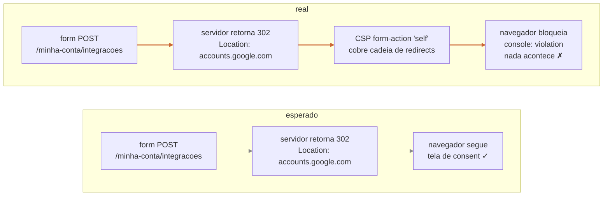
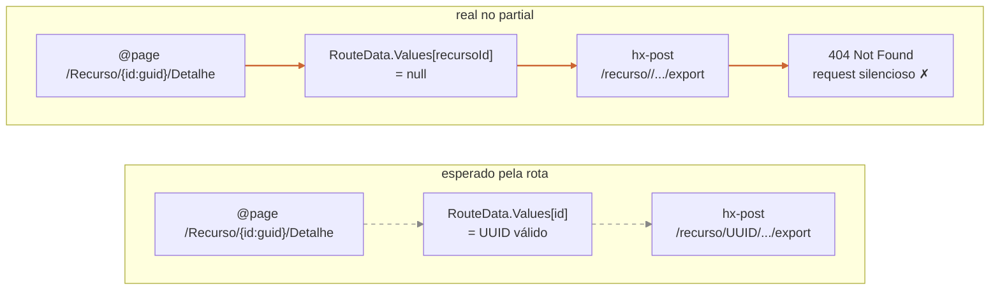
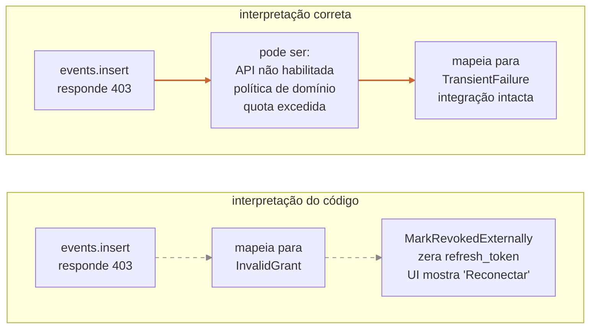
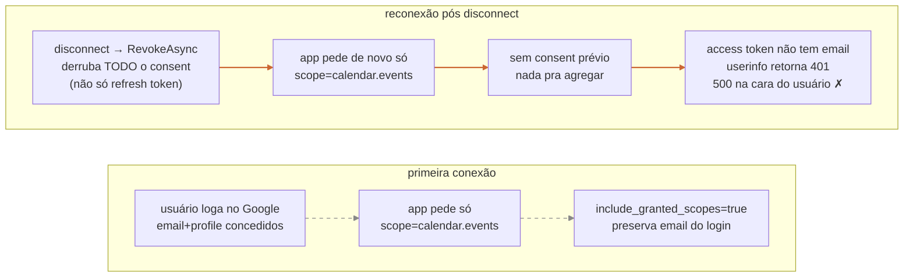

Hoje terminei uma feature inteira do SaaS que eu desenvolvo sozinho. Não foi um endpoint isolado nem um patch cosmético: integração nova com o Google Calendar, OAuth com escopo sensível, cifragem de refresh token em repouso, idempotência via constraint, botão HTMX no resumo, página de gerenciamento, política LGPD atualizada, sub-processador novo registrado. Treze tasks de implementação. Cinco arquivos novos de migration e entidade. Dezenas de arquivos tocados em endpoints, views, partials, services e clientes HTTP.

Trabalhei delegando para subagentes. Cada task tinha um prompt detalhado: o que implementar, o que não tocar, qual padrão seguir, qual teste escrever. Eu agia como engenheiro principal: definia o spec, abria o plano, despachava o subagente, lia o diff, mandava ajustes pontuais, marcava como Done, ia para o próximo. Em dezenas de iterações o ciclo foi sempre o mesmo: subagente entrega, eu revejo, segue.

Quando terminou, o estado do branch era convincente. **688 testes passando.** Build em Release com `TreatWarningsAsErrors=true`: limpo. `dotnet format --verify-no-changes`: zero diferença. Cobertura unitária do parser de datas, do mapeamento HTTP, do builder de payload. Cobertura de integração via Testcontainers para a orquestração com o banco e a cifra do token. Smoke opt-in contra a API do Google real, esqueletado e pulado por default no CI. Política LGPD atualizada, sub-processador documentado, audit log emitindo cinco tipos novos de evento. **Estava bonito. Estava verde. Eu me senti pronto pra abrir a PR.**

Antes de abrir, porém, eu tinha um passo no plano que estava lá desde o início e que eu não tinha pulado em nenhuma feature até hoje: smoke manual end-to-end. Login Google real, conexão real, evento criado de verdade no calendário do usuário de teste, validação visual em cada estado da interface. Foi exatamente nessa fase, com o app rodando em `dotnet watch` e o navegador apontando para `localhost:5000`, que **quatro bugs caíram em sequência. Nenhum deles tinha sido detectado por nenhuma camada de teste automatizada.**

Esse post é sobre os quatro bugs, sobre como eles passaram pelos testes, e sobre o que isso me lembra do ciclo de trabalhar com IA: **delegar não é pular a fase de validação humana. A IA não tem mãos no navegador.**

## A confiança que se acumula sem aviso

```mermaid
flowchart LR
    subgraph "ciclo da sessão"
        direction TB
        T1["Task 1<br/>spec → subagente"] --> R1["review do diff"]
        R1 --> T2["Task 2<br/>spec → subagente"]
        T2 --> R2["review do diff"]
        R2 --> TN["...Task 12"]
        TN --> RN["CI verde<br/>build verde<br/>format verde"]
    end
    style RN fill:#2a4f3a
```



Trabalhar com subagente bem prompted é viciante. O loop fica curto. Eu desenho a próxima task com cuidado (qual arquivo, qual padrão, qual teste, qual nome de tipo), despacho, espero alguns minutos, leio o diff, marco como completed. Cada Done dá uma pequena dopamina de progresso. Cada teste verde reforça a impressão de que o software está sendo construído corretamente.

A armadilha é que **toda a fase de revisão acontece no nível do código, não no nível do produto.** Eu valido se o subagente seguiu os padrões do projeto, se respeitou os invariantes de domínio, se a mudança no schema é compatível com o que já existe, se o nome do método bate com o resto. Nada disso me diz se o software funciona quando um humano abre o navegador, faz login, clica num botão e espera ver um evento aparecer no calendário dele.

O smoke opt-in contra a API real do Google estava lá no projeto desde o começo. É um teste com `[SkippableFact]` que só roda se você setar três variáveis de ambiente. Eu nunca rodei. Em nenhuma sessão da feature. **A fase de validação ficou inteiramente concentrada no final do trabalho, como uma checklist única, e eu cheguei nela depois de ter acumulado centenas de commits de confiança.**

## Bug 1: o botão que silenciava o navegador inteiro



Abri a tela de integrações. Marquei o checkbox de consent. Selecionei a timezone. Cliquei em "Conectar Google Calendar". **Nada aconteceu.** O botão ficou ali, o URL não mudou, o servidor não recebeu request nenhuma.

A primeira hipótese veio do hábito: deve ter dado erro de antiforgery, vou ver o log. Não tinha log nenhum porque o request nunca saiu. A segunda hipótese: deve ser o checkbox `required` que o navegador está bloqueando. Não, eu tinha marcado. Foi quando eu finalmente abri o console do navegador que apareceu a mensagem real:

> Sending form data to 'http://localhost:5000/minha-conta/integracoes?handler=Connect' violates the following Content Security Policy directive: "form-action 'self'".

O middleware de Content Security Policy do projeto declara `form-action 'self'`. Essa diretiva, segundo a spec do CSP, **vale para a cadeia inteira de redirects iniciada por um formulário.** Meu endpoint de Connect faz POST para o próprio servidor e responde com `Redirect(...)` para `accounts.google.com`. O navegador, ao seguir esse redirect, verifica `form-action` contra o destino final, vê que não bate, e bloqueia silenciosamente.

O comentário do middleware afirmava textualmente: "o login Google não usa form POST cross-origin, e sim um redirect 302 server-side disparado pelo Challenge do OAuth, que não é gerido pela diretiva form-action". Estava correto para o **login**: ali o `Challenge` é um GET. Mas o **connect do Calendar** é um POST de formulário, e a regra do CSP é diferente. O comentário do código tinha virado falso quando uma feature nova foi acrescentada, e nenhum teste apanhou a regressão porque **nenhum teste exercia o navegador real.**

### Por que CI verde não pegou

Os testes de integração do endpoint usam `WebApplicationFactory`. Eles enviam requests HTTP diretamente para o pipeline ASP.NET. Nada nesse fluxo passa pelo navegador. CSP é um header HTTP que o servidor envia e que **só tem efeito quando interpretado pelo cliente.** Os testes que verificam que o servidor envia o header existem (na verdade existem testes locking o `SecurityHeadersMiddleware`). O que não existe é teste que verifica se o header impede o navegador real de seguir um redirect que a feature nova precisa.

O Playwright do projeto, que roda no E2E como parte do quality gate, faz login, navega, faz upload. **Não tem fluxo de connect com Calendar.** A feature era nova; o teste E2E para o connect novo seria a definição literal de smoke manual, então foi deferido como "vamos cobrir num teste E2E futuro" (uma frase que, em projetos solo, costuma significar nunca).

O CSP era uma string num middleware. Os testes do middleware checavam que a string saía no header. Mas a interação entre a string e o resto do sistema (um botão novo que dispara um POST que faz um redirect cross-origin) só apareceu quando o sistema inteiro foi exercido por uma pessoa.

## Bug 2: a URL implícita que ninguém pediu



Corrigido o CSP, o smoke seguiu. Conexão funcionou, o Google pediu o escopo de calendário, o callback voltou, a tela mostrou "Conectado em 28/05/2026". Subi dados fake direto no banco para ter três itens com datas futuras parseáveis. Abri a tela onde os botões deveriam aparecer. Os três botões "+ Adicionar ao Calendar" estavam lá, corretamente posicionados nos itens. Cliquei.

**Console do navegador:**

> POST http://localhost:5000/recurso//.../export 404 (Not Found)

O caminho na URL tinha **duas barras seguidas**. O parâmetro do recurso saiu vazio. Olhando o partial Razor:

```html
<form hx-post="/recurso/@ViewContext.RouteData.Values["recursoId"]/.../export">
```

O autor do partial (um subagente meu, na task de implementar o botão e o endpoint) assumiu que o parâmetro de rota se chamava `recursoId`. Mas a rota da página que renderiza o partial declara o parâmetro como `id`, não como `recursoId`. Quando o partial é renderizado dentro do contexto dessa página, `RouteData.Values["recursoId"]` retorna `null`, e o template Razor produz a string com a barra dupla.

O fix correto não foi mudar o partial para ler `RouteData.Values["id"]`. Esse caminho mantém um acoplamento implícito ruim entre o partial e o nome do parâmetro de rota da página que o renderiza. A correção foi passar a URL via ViewModel: o partial recebe um `PostUrl` explícito, e quem renderiza o partial é responsável por compor essa URL a partir do identificador que ele já tem em escopo. Contrato explícito; o partial deixa de adivinhar.

### Por que CI verde não pegou

Existiam quatro testes de integração para o endpoint do clique. Cobriam: criação bem-sucedida, idempotência em sequência, idempotência em concorrência, e o caso em que o usuário não tinha integração ativa. **Todos os quatro montavam a URL do POST programaticamente nos arquivos de teste**, com o identificador correto no lugar certo. Os testes nunca renderizaram o partial Razor que produz o `hx-post`. Eles testavam o **endpoint isoladamente**, com a URL já correta.

O Playwright também não cobria esse fluxo. O botão era novo; o E2E que clicaria nele e veria a requisição partir teria sido o smoke manual em forma de teste automatizado, e como combinei lá em cima, esses E2Es novos foram deferidos.

A ironia é boa: o endpoint funcionava perfeitamente. Era a única peça do fluxo que não tinha bug. Quem tinha bug era o **partial que monta a URL para chamar o endpoint**, e nenhum dos quatro testes ia ali.

## Bug 3: o falso positivo que se autoautorrecuperava



Conectei. Voltei à tela e cliquei em adicionar evento. **A resposta foi: "Reconectar Calendar".** O estado do botão mudou para o que normalmente aparece quando o Google revoga o refresh token externamente. Mas eu tinha acabado de conectar segundos atrás. Não fazia sentido.

Fui no log. O OAuth refresh tinha respondido 200 OK. Token válido. O `events.insert` é que tinha respondido **403 Forbidden**. O código mapeava 403 para `InvalidGrant`, e isso disparava a rotina que zera o refresh token cifrado e marca o status local como revogado externamente.

A interpretação do código estava errada. **403 no Calendar API não significa que o refresh token foi revogado.** As causas comuns são outras: a Calendar API não está habilitada no projeto do Google Cloud, há política administrativa de domínio bloqueando o escopo, ou quota excedida do projeto. Nenhuma dessas é "o usuário revogou o consent". Zerar o refresh token nesses cenários é falso positivo: o token continua válido, o problema é configuração no nosso lado do GCP Console, e o usuário recebe "Reconectar" sem nenhuma forma de resolver porque reconectar não conserta.

O fix foi mapear 403 para `TransientFailure`: integração local intacta, UI mostra erro recuperável, log captura o body do 403 para diagnóstico. Apenas 401 (Unauthorized) sinaliza token inválido e justifica revoke local. O caso 403 ganhou um teste novo no nível do endpoint.

### Por que CI verde não pegou

Aqui é o caso mais desconfortável. **Existia um teste unitário do mapeamento HTTP que asseverava exatamente o comportamento errado:**

```csharp
[Theory]
[InlineData(HttpStatusCode.Unauthorized, CalendarInsertOutcomeKind.InvalidGrant)]
[InlineData(HttpStatusCode.Forbidden, CalendarInsertOutcomeKind.InvalidGrant)]  // <- aqui
[InlineData((HttpStatusCode)429, CalendarInsertOutcomeKind.RateLimited)]
```

O teste passava. O código fazia o que o teste mandava. O subagente que escreveu o teste, e o subagente que escreveu o mapeamento, e o subagente que escreveu o endpoint, todos estavam consistentes entre si. **O problema era que ninguém parou para perguntar se o teste estava certo.**

Eu também não parei, durante todas as revisões dos diffs. "401 e 403 são erros de auth, ambos viram InvalidGrant" soa razoável quando você lê o diff em isolamento. Só quando o sistema inteiro foi exercido contra a API real, com uma causa que não tinha nada a ver com auth (a Calendar API estava habilitada, mas o teste do humano expôs um caminho onde o mapeamento errado tinha consequências visíveis na UI), é que a hipótese caiu.

Esse é o pior tipo de regressão silenciosa: **o teste documenta um bug, e o teste passa.** Você precisa de uma cabeça que conheça a semântica do domínio para perguntar "isso realmente é assim?". Subagente bem prompted segue o pattern; ele não vai questionar a premissa do pattern a menos que você peça especificamente. E quando você lê dezenas de diffs em uma sessão, sua cabeça também não vai parar em cada `[InlineData]` para validar contra a documentação do Google.

## Bug 4: o cenário que só existe na segunda vez



Continuei o smoke. Criei o evento (depois de habilitar a API e corrigir o mapeamento), validei no calendário real, vi o summary, a description, o link de volta, a timezone. Funcionou. Voltei para a tela de integrações e cliquei em "Desconectar". O banco confirmou: `status='Disconnected'`, `refresh_token_cipher IS NULL`.

Cliquei em "Conectar Google Calendar" para reconectar. A tela do Google apareceu, autorizei, e voltei. **HTTP 500 na cara.** Stack trace:

```
HttpRequestException: Response status code does not indicate success: 401 (Unauthorized).
  ResumoProcessual.Web.Pages.Account.GoogleCalendarCallbackModel.ResolveGoogleEmailAsync
  ResumoProcessual.Web.Pages.Account.GoogleCalendarCallbackModel.OnGetAsync
```

O callback estava tentando chamar `https://www.googleapis.com/oauth2/v3/userinfo` com o access token recém emitido. O Google respondeu 401. Que erro mais estranho: o access token é novo, foi acabado de ser emitido.

A causa, depois de meia hora de hipóteses ruins (DataProtection keys roladas, refresh token corrompido, scope errado), foi a seguinte. O endpoint `userinfo` precisa de pelo menos um destes escopos: `openid`, `email`, ou `profile`. O scope que o nosso app pede no URL de Authorize é literalmente:

```
&scope=https://www.googleapis.com/auth/calendar.events
```

Só `calendar.events`. Sem identidade. **Na primeira conexão, isso funcionava** porque o usuário tinha feito login no app via Google OAuth e já tinha concedido `openid email profile` no login. A flag `&include_granted_scopes=true` no URL de Authorize diz ao Google "soma o consent atual com tudo o que já foi concedido antes". O access token resultante carregava `email` herdado do login.

**Mas o `RevokeAsync` que eu mandei no disconnect não revoga só o refresh token específico. Revoga o consent inteiro do meu OAuth Client.** Email, profile, openid, calendar.events: tudo zerado. Quando o usuário reconecta, `include_granted_scopes=true` não tem nada pra agregar (porque não há mais consent existente). O access token novo tem só `calendar.events`. Acesso a `userinfo` resulta em 401.

O fix foi pedir os escopos de identidade explicitamente em toda Authorize URL, e blindar o callback para que falha no `userinfo` não derrube a conexão (o email é apenas exibição na tela; a integração funciona sem ele).

### Por que CI verde não pegou

Esse é o tipo de bug que precisa de **estado interno do Google** para reproduzir. Os testes do projeto stubam o `IGoogleOAuthHttpClient` para devolver um access token e um refresh token; nunca exercitam o flow de OAuth real do Google contra o `userinfo` endpoint. A interação entre `RevokeAsync` e `include_granted_scopes` é um efeito documentado do protocolo (eu fui ler depois), mas é um efeito que **só aparece quando o smoke é feito na segunda vez**, depois de um disconnect, contra a infra real do Google.

Nenhum teste unitário, integração ou E2E que eu (ou um subagente) escrevesse contra stubs ia pegar isso. O Google não está no loop. O comportamento que falha é uma reação do servidor do Google a uma sequência específica de chamadas. **Stub não modela invariantes de servidor remoto.**

O smoke opt-in contra a API real existia, mas testava criar e apagar um evento, não testava o ciclo disconnect-reconnect. Eu poderia ter escrito esse cenário antes; não escrevi. E mesmo se tivesse, ele precisaria de uma credencial real, opt-in, fora do quality gate. **Não é o tipo de teste que entra no caminho crítico do CI.**

## A tentação de seguir em frente

Cada um desses quatro bugs, isoladamente, é uma história pequena. CSP cobre redirect de form. Razor RouteData não tem o parâmetro com o nome que o autor assumiu. 403 não é 401. Revoke do Google derruba consent inteiro. **São coisas que devs experientes em OAuth e em Razor já viram.** Eu já tinha visto algumas delas. O subagente, no momento de escrever cada peça, não viu, porque cada peça em isolamento parece plausível.

A tese que eu quero deixar é maior do que os quatro bugs:

Quando você delega para IA bem, o ciclo de implementação acelera muito. **Um dia de trabalho rende o que seria uma semana.** A produção de código é rápida, os subagentes são focados, os reviews são curtos, os commits limpos. Tudo isso é real e valioso. Mas a **produção de software** (a coisa que efetivamente funciona quando uma pessoa usa) avança no ritmo da fase mais lenta, e a fase mais lenta continua sendo a validação humana contra o ambiente real.

Se eu não tivesse parado para o smoke manual, eu teria aberto a PR com `688 tests passed, build green`, mergeado, deployado para staging, e descoberto os quatro bugs em ordem aleatória ao longo de dias. O custo de reverter cresce a cada hora que o código fica em main e em produção. O custo de descobrir cresce em proporção inversa à quantidade de gente olhando: num time grande, alguém abre o navegador rapidinho. Num projeto solo, a única pessoa que abre o navegador sou eu, no tempo que eu reservo para isso.

E a tentação de pular essa fase é proporcional à confiança que o CI verde gerou. **Esse é o efeito mais perigoso de trabalhar com subagente.** Você acumula 30 ou 40 ou 80 sinais positivos em sequência (Done, Done, Done, build verde, format verde, teste verde) e quando chega na hora de fazer a fase devagar, com paciência, em câmera lenta, no navegador, sua cabeça já está convencida de que vai dar tudo certo. Você abre o app, faz a primeira ação, e quando o botão não dispara nada, sua reação imediata é "deve ser bobagem, vou direto pra próxima". Foi assim que eu descobri o bug 1: meu primeiro instinto foi continuar testando, e o usuário (uma versão minha mais teimosa, neste caso) parou e abriu o DevTools.

## O que aprendi (mais uma vez)

**Um:** **subagente é colega júnior brilhante, não autopilot.** Implementa rápido, segue o padrão, escreve teste consistente com o código. Mas teste consistente com o código não é teste do código contra a realidade. Você continua sendo o engenheiro principal, responsável pela revisão das premissas. Quando o subagente escreve `[InlineData(HttpStatusCode.Forbidden, InvalidGrant)]`, ele não vai questionar se Forbidden realmente é InvalidGrant, porque a questão está fora do prompt. Só você pode parar e perguntar "espera, é mesmo?".

**Dois:** **CI verde mede o que você se lembrou de testar.** Smoke manual mede o que você esqueceu. As duas medidas são importantes; a segunda tende a ser a que pega bug. Em time de uma pessoa, a tentação é matar a segunda em nome da velocidade. O custo dessa decisão aparece na próxima sessão, ou no próximo deploy, ou pior, com um usuário descobrindo o bug pra você.

**Três:** **stub não modela invariantes de servidor remoto.** Bug 4 é o caso mais limpo disso. O comportamento que estava errado depende de uma reação do Google a uma sequência específica de chamadas. Você pode escrever cem testes contra stubs e nenhum deles pega isso. Smoke contra a infra real, ainda que opt-in e fora do quality gate, é o único teste que tem chance de pegar. Vale ter, vale rodar manualmente, vale documentar como pré-condição da feature estar pronta.

**Quatro:** **comentários no código viram falso silenciosamente quando uma feature nova é acrescentada.** O comentário do CSP do projeto afirmava que `form-action 'self'` era seguro porque "o login Google não usa form POST cross-origin". Era verdade na hora em que foi escrito. Quando uma feature nova (connect do Calendar) acrescentou exatamente um form POST cross-origin, o comentário virou mentira, e ninguém atualizou. Comentários explicando porquê de decisões são valiosos; comentários explicando porquê de premissas precisam ser revistos a cada feature que mexe com a premissa.

**Cinco:** **um teste que documenta um bug e passa é o pior tipo de cobertura.** Bug 3 é o exemplo: tinha teste, o teste passava, o teste estava errado. A cobertura subia. A confiança subia. O bug seguia lá. Se eu fosse desenhar uma sentinela contra essa classe de problema, seria algo como: revisão obrigatória de qualquer asserção feita sobre integração externa contra a documentação oficial do provider, no momento em que a asserção é escrita. Demora cinco minutos. Pega bug que sobreviveria a milhares de runs de CI.

**Seis:** **a fase de validação humana não é negociável, e não dá pra empurrá-la pro final.** No meu fluxo, eu deixei o smoke manual para a última task da feature, depois de doze tasks de implementação. Quando cheguei nela, eu já tinha aberto subbranch, scripted seed de dados, e estava pensando na próxima feature. **A latência entre o último teste automatizado verde e o primeiro teste manual real virou dias**, e isso é tempo demais. Numa próxima feature de tamanho parecido, eu vou rodar smoke manual depois de cada subset de tasks que produz uma slice end-to-end utilizável, não no fim. Pegar bug 1 (CSP) na task em que o botão foi montado, e não na task em que o evento real foi criado, teria me economizado o ciclo inteiro de "subagente entrega → CI verde → confiança → smoke → bug → fix → push".

**Sete:** **a IA é uma alavanca. A alavanca não decide pra onde apontar.** Cabe ao engenheiro principal escolher o que delegar, escolher como revisar, escolher quando parar e validar com mãos e olhos. A tentação de delegar a próxima task imediatamente após Done é forte, e a IA nunca vai recomendar que você não delegue. Você precisa ser o adulto na sala que segura a próxima delegação até ter exercido o que foi entregue.

## E daqui pra frente

A PR fechou com 24 commits da implementação, mais 7 commits dos fixes do smoke manual, mais 7 commits resolvendo sugestões da revisão automatizada. Trinta e oito commits no total. O ciclo gastou um dia inteiro entre smoke, fixes, PR, revisão, merge. O código que está em main hoje é melhor que o que estava no branch quando eu achei que tinha terminado. Os quatro bugs que apareceram no smoke não estão lá. Os dois bugs que apareceram no review da PR também não estão.

A coisa que ficou mais clara, para mim, é que **a fase de validação humana é a única em que o sistema é exercido de verdade.** É lenta porque humanos são lentos comparados a CI. É frágil porque depende da minha atenção num momento em que minha cabeça já comprou a tese "tá tudo certo". E é insubstituível, pelo menos no estado atual da prática, porque é a única fase em que todas as camadas do sistema (servidor, browser, protocolo OAuth real, servidor remoto do provider, banco real, e cabeça humana) estão simultaneamente em loop.

Se eu tivesse que reduzir o aprendizado a uma frase: **a IA escreve o código que funciona em testes; só uma pessoa, no navegador, em câmera lenta, descobre se o software funciona. Pular essa fase não é otimização: é colocar o problema na cabeça do usuário, ou na sua, daqui a três dias, num momento em que vai custar mais caro.**
