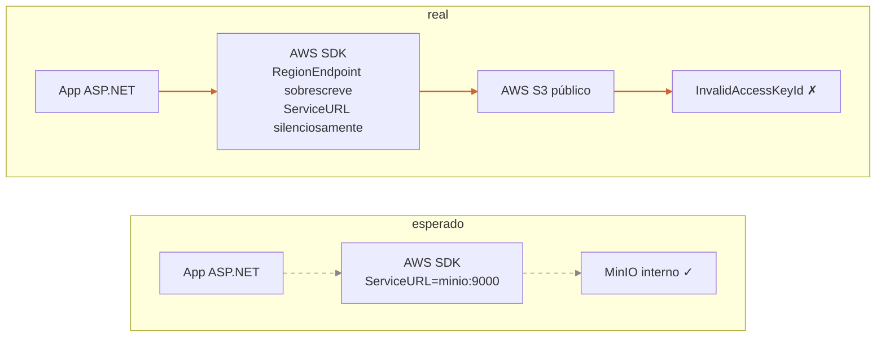
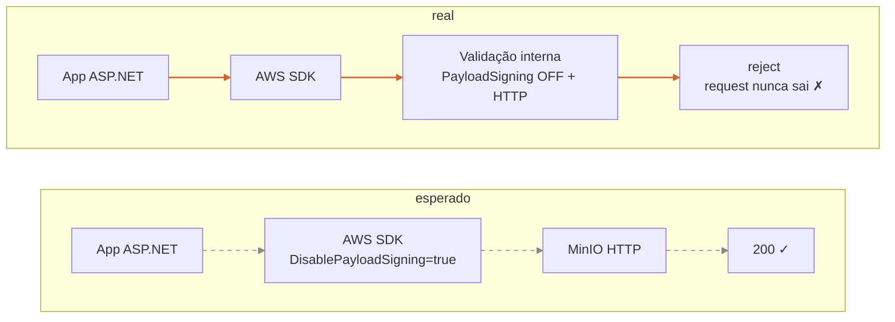
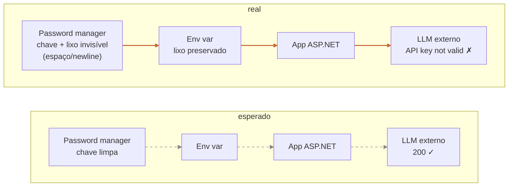
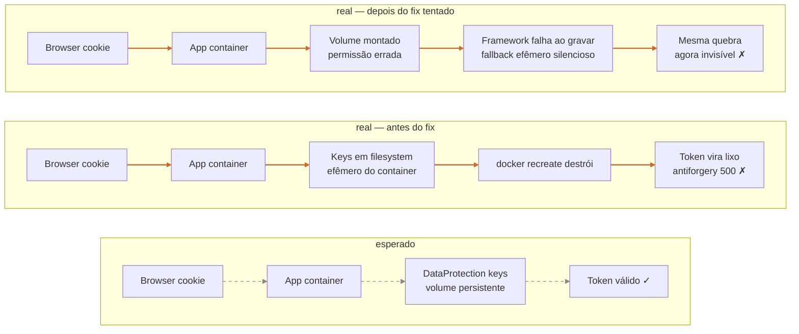

Hoje passei a tarde tentando entender por que um sistema que tinha CI verde, deploy verde, login OAuth funcionando e healthchecks felizes não conseguia salvar um único arquivo num bucket. Resolvi escrever isso porque acho que a coisa mais útil que aprendi não foi nenhum dos quatro bugs que descobri ao longo do dia, mas a forma como eles, juntos, formam uma evidência irrefutável de uma coisa que a gente fala muito e leva pouco a sério: **"funciona em dev" é um dado quase inútil.**

Vou contar a sequência sem detalhe do domínio. O produto não importa: é um SaaS qualquer em .NET que recebe um arquivo do usuário, armazena num bucket S3-compatível, processa de forma assíncrona e devolve um resultado. Stack é ASP.NET, Postgres, MinIO em produção, um LLM externo para o processamento, e tudo orquestrado por Docker Compose numa VPS. Em dev local: Postgres em container, storage em filesystem local, LLM em fake. Em produção: tudo real, tudo de verdade, tudo pela primeira vez.

A sessão anterior tinha sido o "deploy de go-live". HTTPS subiu, OAuth subiu, e-mails subiram. Tudo verde. Foi o tipo de noite em que você fecha o laptop achando que terminou. Quando voltei hoje pra fazer o primeiro upload real, o servidor devolveu HTTP 500. Nada nos logs do app. Nada no trace do bucket. O cliente HTTP do navegador só dizia "deu erro". A história abaixo é o caminho até descobrir, em quatro passos, que praticamente nenhuma parte do código que estava sendo exercitada em produção tinha sido exercitada antes.

## Bug 1: o endpoint que apontava pro lugar errado



O primeiro sintoma era específico e enganoso: o SDK oficial da AWS, configurado para falar com o storage interno, devolvia uma mensagem de erro **idêntica** à que o S3 da AWS real retorna quando você passa uma chave inválida.

Stack trace acusava `InvalidAccessKeyId`. Eu tinha acabado de configurar a chave dedicada do storage local. Confirmei três vezes que a chave existia, que a policy estava attached, que o CLI oficial do storage funcionava com as mesmas variáveis de ambiente. Mesmo erro. Para piorar, o trace do servidor de storage não capturava nenhum `PutObject` chegando. O request simplesmente não aparecia lá dentro.

Levou um tempo até eu perceber a única possibilidade compatível com todas as evidências: o request **não estava indo para o storage interno.** Estava indo para a AWS real. A mensagem de erro era literal: a AWS de verdade nunca tinha ouvido falar daquela chave porque ela não pertencia a conta nenhuma da AWS.

Causa raiz, do tipo que dá vontade de jogar o computador pela janela: o SDK aceita configurar `ServiceURL` (endpoint customizado) **e** `RegionEndpoint` (região oficial da AWS) ao mesmo tempo. Quando os dois estão setados, em vez de erro, o SDK silenciosamente ignora o `ServiceURL` e usa o endpoint regional da AWS real. Existe [issue aberta](https://github.com/aws/aws-sdk-net/issues/1781) sobre isso desde a versão 3.x. O comportamento foi pra versão 4.

Em dev local eu tinha código que escolhia entre dois providers: armazenamento local (filesystem) e S3-compatível. O default em dev é o provider local. O caminho do S3-compatível nunca foi rodado em desenvolvimento. A primeira vez que aquele bloco de DI rodou contra um servidor de verdade foi em produção, no primeiro upload do primeiro usuário. Era uma armadilha que estava dormindo lá há semanas.

O fix foi cirúrgico: quando `ServiceURL` está preenchido, não setar `RegionEndpoint`, e em vez disso usar `AuthenticationRegion` (que afeta só a assinatura SigV4, não o endpoint). PR, CI verde, merge, deploy.

## Bug 2: o fix que destravou o próximo bug



Tentei o upload de novo. Erro novo:

```
When DisablePayloadSigning is true, the request must be sent over HTTPS.
```

Tradução: o SDK acabou de adicionar uma validação que rejeita um request com `DisablePayloadSigning=true` se o destino for HTTP. A intenção é razoável: sem signing do payload e sem TLS, qualquer um no caminho pode alterar o conteúdo sem o servidor perceber. Mas meu MinIO interno é HTTP. A rede é só dentro do Docker. O TLS começa no reverse proxy da borda, não no caminho app para storage.

Esse `DisablePayloadSigning=true` tinha sido uma otimização que eu mesmo escrevi quando comecei a integrar com MinIO: pra storage local, deixar o framework calcular o hash SHA-256 do arquivo inteiro só pra assinar parecia desperdício. O SDK antigo deixava você desligar. O SDK novo deixa também, **mas só se o destino for HTTPS**.

O sintoma só apareceu agora porque o bug número 1 estava interceptando o request antes desse handler do pipeline ter chance de validar. Cada bug era um bloqueio antes do próximo bug.

Removi a flag. O fix foi de uma linha. PR, CI verde, merge, deploy. Tentei o upload de novo. Funcionou. Arquivo chegou no bucket, foi lido pelo worker assíncrono, mandado para o LLM e:

## Bug 3: o gerenciador de senha que sabotou



```
API key not valid. Please pass a valid API key.
```

O LLM rejeitou a chave. Confirmei no console do provider que a chave existia, estava ativa, com restrição de IP correta para o IP de saída da VPS, e a API correta marcada na restrição. Tudo certo.

Confirmei no servidor que a chave estava configurada no ambiente do app. O length do valor armazenado não batia com o length canônico que esse provider gera. Tinha caracteres a mais.

A chave tinha sido salva no gerenciador de senha com lixo extra: provavelmente espaços, quebras de linha, ou parte da legenda do campo no formulário. Quando a config do servidor puxou esse valor, puxou o lixo junto. Toda chamada saía com uma chave que o provider nunca tinha visto.

Esse não foi um bug de software. Foi um bug de processo. E é o que mais me incomoda da história inteira, porque é o tipo de coisa que **nenhum teste, nenhum CI, nenhum review** pegaria. Foi cabeça de operador, num momento em que a fadiga já estava se acumulando.

Fix manual no arquivo, recreate do container, hard refresh no browser, upload, pipeline inteiro verde.

## Bug 4: o efêmero que ninguém viu



Em paralelo, eu tinha notado: **toda vez** que eu recriava o container do app, qualquer aba que o navegador tinha aberta antes do recreate quebrava. POST devolvia 500. Stack trace acusava antiforgery token inválido.

O motivo era que o ASP.NET, configurado no default, persiste as chaves de DataProtection (que assinam o antiforgery token, os cookies, etc.) num diretório dentro do container. Esse diretório não tinha volume montado. Toda recreate descartava as chaves. Toda recreate transformava todos os tokens anteriores em lixo criptográfico.

Em dev eu praticamente nunca recriava o container. Rodava o `dotnet run` direto, e as chaves moravam num diretório da minha máquina que persistia entre execuções. Em produção, recreate é a operação default de deploy. Era um problema invisível em dev, garantido em prod.

Fix conceitualmente trivial: persistir o diretório fora do filesystem efêmero do container. Mas o storage persistente nasceu com permissões diferentes das que o processo do app tinha. Permission denied na primeira gravação. E aqui veio o detalhe pior: em vez de explodir, o framework silenciosamente caiu num fallback efêmero, e tudo continuou parecendo OK enquanto efetivamente não estava. Foi um bug em cima do fix, mas com camuflagem extra.

## O denominador comum

Quatro bugs, quatro origens diferentes (config do SDK, validação nova do SDK, gerenciamento de senha, default do ASP.NET). Um padrão único: **nenhum deles era exercitável em dev.**

- Bug 1: em dev, o código de S3 nem era executado. O provider local era usado.
- Bug 2: idem. Versão da biblioteca era a mesma, mas o pipeline da biblioteca nunca chegou na validação que falhou.
- Bug 3: em dev, a chave do LLM era fake. Não vai ao provider real. Não tem como descobrir que a chave em produção foi mal copiada.
- Bug 4: em dev, eu não recriava o container. O cenário só acontece quando o container é descartado e renasce. Operação inexistente no fluxo de desenvolvimento.

Em comum: **caminhos de código com substitutos em dev que escondiam a forma real do caminho em produção.**

Mocks têm uma armadilha. A gente os introduz porque o dependente real é caro, lento, instável, ou exige rede. E a gente raciocina sobre eles como se fossem o real. O mock do storage devolve `Task<Stream>` igual o real. O mock do LLM devolve um JSON igual o real. O fluxo do request bate em volume, em encoding, em retry, em validação. Mas a forma real do caminho, todos os handlers do pipeline, todas as decisões de roteamento, todos os comportamentos não-documentados do SDK que o mock não imita: isso só aparece quando você toca o real.

## O que eu aprendi (de novo)

Coisas que eu já tinha lido. Coisas que repeti em retrospectiva de outros projetos. Coisas que voltaram pra atropelar.

**Um:** smoke contra o ambiente real é insubstituível. Não é um item de checklist, não é uma boa prática, não é "se sobrar tempo". É **o evento que valida o deploy.** Tudo antes é hipótese.

**Dois:** mocks em dev escondem mais do que conveniência. Se o teu desenvolvimento local roda 100% no fake, o deploy é o smoke. Considere ter pelo menos um modo de desenvolvimento que exercita os adapters reais (storage real local, mesmo que efêmero; LLM real com quota limitada; container recriado periodicamente). Cada componente que não roda em dev é um campo minado.

**Três:** observability barata vale ouro caro. O que destravou cada um dos quatro bugs foi log. Log do app, trace do storage, log do reverse proxy, log do framework. Em vários momentos eu fui no caminho errado porque não conseguia ver o estado de uma camada. Quanto mais cedo você consegue ver o **request bruto** chegando em cada camada, mais rápido você decide se o problema é antes, durante ou depois daquela camada.

**Quatro:** quando vários bugs estão empilhados, eles se mascaram. O fix do primeiro **destrava** o segundo. Você não consegue ver o segundo até resolver o primeiro. Isso significa que terminar o deploy é iterativo, não sequencial: cada fix abre uma nova frente. Reserve tempo pra isso. "Vai ser rápido, é só um fix" raramente é só um.

**Cinco:** debugging sistemático ganha de chutômetro. Foi a única razão por que eu não passei 12 horas no problema número 1. Documentar a hipótese antes de testar. Eliminar uma variável de cada vez. Comparar com o caminho que funciona (no meu caso, comparar o que o CLI oficial fazia vs o que o SDK do app fazia). Resistir a "vou tentar isso só pra ver". Cada fix tentado às cegas vira ruído permanente no banco de dados de hipóteses que você precisa segurar na cabeça.

**Seis:** a fadiga é um adversário real. O bug número 3 foi o único bug não-técnico do dia. Aconteceu porque, numa sessão anterior cansada, eu colei uma chave do gerenciador de senha sem conferir o conteúdo. Não é "falta de processo": é cérebro saturado. Pra trabalhos solo, isso é o sinal de parar, não de empurrar mais. O custo de empurrar mais é exatamente o tipo de erro que ninguém revisa porque é só você.

## E daqui pra frente

A sessão fechou com o sistema funcionando ponta-a-ponta em produção. Quatro pull requests mergeadas em menos de seis horas. Uma issue de follow-up no backlog. Várias notas mentais sobre quais caminhos não-exercitáveis em dev ainda existem no produto e provavelmente vão queimar de novo no próximo cenário novo.

Se eu tivesse que reduzir o que aprendi a uma frase, seria: **dev é uma simulação útil, prod é a única realidade.** Toda decisão arquitetural que cria distância entre os dois é uma decisão que vai cobrar juros no dia do deploy. Vale a pena pagar adiantado, em forma de ambientes mais realistas, smokes mais cedo, mocks mais sinceros. Quase nunca a gente paga.
