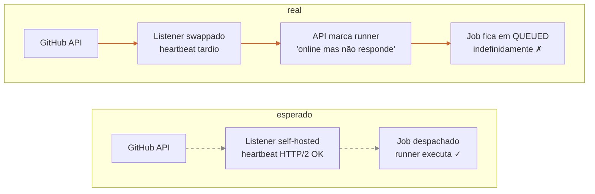
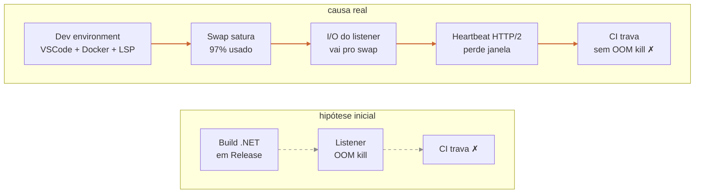
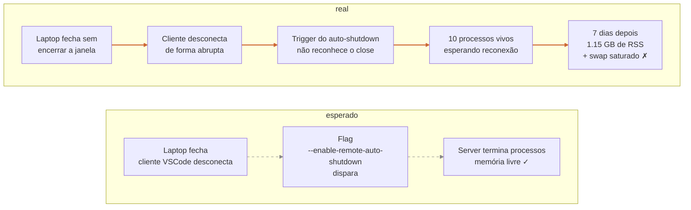

Hoje fechei uma sessão técnica que tinha ficado pendente no meu backlog há semanas: investigar por que o runner self-hosted do meu CI travava de tempos em tempos e precisava de um restart manual. O problema era recorrente, irritante, e tinha uma "solução temporária" tão rápida (`sudo ./svc.sh stop && sudo ./svc.sh start`, trinta segundos) que cada vez que aparecia eu corrigia e seguia tocando. A análise séria ficou pra "quando der tempo".

Quando finalmente parei pra investigar de verdade, descobri que **o culpado primário não estava em lugar nenhum da minha lista de suspeitos.** Estava num processo do meu IDE remoto, morto há sete dias, que eu tinha esquecido de fechar e ninguém matou por mim. Esse post é sobre a história inteira e sobre o que ela me lembrou da economia de não pagar por infraestrutura: ela existe, ela é legítima, mas não é gratuita. Só é cobrada numa moeda diferente.

## A VPS já estava lá

Eu desenvolvo um SaaS sozinho. .NET, Postgres, Docker, um LLM externo, deploy em VPS. Stack escolhida pra ser barata e portátil, não pra escalar pra milhões. O projeto é pré-receita. Cada centavo de custo recorrente tem que ter um pra que claro.

Pra dev local eu uso uma máquina relativamente humilde, mas com um detalhe: o ecossistema oficial pra essa stack é pesado, e meu hardware não roda IDE + Docker + serviços de dev ao mesmo tempo de forma confortável. Solução: uma VPS com 8 GB de RAM, 4 vCPU, 150 GB de disco. VSCode Remote via SSH. O laptop só renderiza a UI; CPU e RAM ficam na VPS. Custo: poucos dólares por mês, valor cristalino.

Em paralelo, o CI do projeto rodava no GitHub Actions. Free tier: 2000 minutos por mês. Por meses a fio sobravam minutos. Em maio, o consumo bateu 90% antes do dia 20. Reset só em 1 de junho. E a fase seguinte do produto ia ser intensiva de CI: smoke tests contra um provider LLM real, E2E com Playwright em runners completos. Se eu não fizesse nada, ia bater o teto antes do mês acabar e o gate ia parar. Pagar não estava nos planos. Pelo menos não esse mês.

Olhei a VPS. Estava ociosa metade do tempo (eu durmo, ela continua lá). Tinha CPU sobrando, RAM sobrando, disco sobrando. **A decisão pareceu óbvia**: registrar a VPS como self-hosted runner do GitHub Actions, mover o workflow inteiro pra ela, deixar o free tier intocado pra emergências. Setup de meio dia. Runbook entrou no repo como parte do PR de migração. Tudo verde em uma tarde.

## Wall-clock subiu, custo zerou

O primeiro efeito mensurável foi positivo. Custo de Actions caiu pra zero. Wall-clock total da CI subiu de uns três minutos (paralelo em quatro VMs do GitHub) pra uns oito (serializado num runner único). Trade-off conhecido, aceito. Pra projeto solo, tempo de CI não é o gargalo: o gargalo é minha cabeça pra pegar review.

Por semanas correu bem. PR via CI, merge, deploy. Os jobs do quality gate todos passavam. O free tier ficou inteiro disponível.

## A primeira pane que ninguém investigou



Em algum momento, um PR ficou com o quality gate eternamente em `QUEUED`. A API do GitHub dizia que o runner estava online. O painel do runner self-hosted dizia que estava ocioso. Mas nenhum job era despachado.

Fui ver no servidor. SSH na VPS, `sudo systemctl status` no serviço do runner: ativo, sem erro. `journalctl`: silêncio. Parado mas vivo. Tentei o que qualquer um tenta: `sudo ./svc.sh stop && sudo ./svc.sh start`. Trinta segundos depois, os jobs queueados despacharam. Tudo voltou ao normal.

Anotei como bug, classifiquei como "memória" (assumindo o suspeito de sempre: OOM do listener), abri uma issue no backlog, marquei como Medium e continuei tocando. A próxima feature era mais importante do que entender por que.

E foi assim por semanas. Quando aparecia, restart, anotação "voltou a acontecer", segue. **Cada vez tomava trinta segundos pra resolver e trinta segundos pra anotar. Vinte vezes por mês é vinte minutos. Toil dentro do tolerável.**

## Quando finalmente investiguei



Algumas semanas depois (eu poderia ter ido antes, eu deveria ter ido antes, eu sei) abri tempo pra investigar de verdade. O instinto era que estava ficando sem memória. Self-hosted runner com 8 GB de RAM, alguém ia me dizer que o build do .NET em modo Release está estourando o budget.

Coletei evidências. `systemctl status` do serviço do runner reportou: `46.4M memory peak, 0B memory swap peak`. Pico de 46 megabytes em todo o ciclo. **O listener é leve. Não é ele consumindo.**

`journalctl`: zero OOM kill no kernel log. Zero sinal de SIGKILL pra qualquer processo do runner. O sistema operacional nunca decidiu matar nada.

`free -h`, no momento de um travamento:

```
Mem:   7.6Gi total / 3.1Gi used / 4.1Gi available
Swap:  4.0Gi total / 3.9Gi used / 50Mi free
```

**O swap estava saturado. 97% usado.** A RAM tinha folga. O kernel não estava matando ninguém porque ainda tinha swap disponível. Mas I/O de swap é ordens de magnitude mais lenta que I/O de RAM, e qualquer página que o listener precisava acessar potencialmente vinha de lá.

A consequência foi inesperada e clara: o listener é um processo Node que mantém um session HTTP/2 com a API do GitHub. Esse session tem timers, tem heartbeats, tem janelas de resposta. Quando o I/O fica lento, o listener perde alguma janela, o session degrada, e a API do GitHub começa a tratar o runner como "online mas não respondendo". Resultado: o runner está vivo, está saudável do ponto de vista do processo, mas o GitHub não despacha trabalho pra ele.

**O listener é vítima, não vilão.** Quem satura o swap é outra coisa.

`ps aux --sort=-%mem | head -15` mostrou o ranking:

- VSCode Remote node (extension host): 658 MB
- dockerd: 626 MB
- Claude Code background daemon: 265 MB
- Roslyn LSP (a parte que faz IntelliSense do .NET): 163 MB
- Outros processos do dev environment: vários, 50-100 MB cada
- actions-runner Listener: 115 MB

Soma do dev environment: ~1.7 GB, fácil. Mais cache, mais buffers, mais o overhead normal de um Linux com Docker e systemd. A RAM viva fica em torno de 3 GB, o que sobra vira cache, e o swap acumula tudo o que foi tocado e não é mais ativo.

A causa raiz ficou clara: **eu coloquei o runner num host que já tinha um vizinho de quarto pesado: meu próprio dev environment.** Quando ele estava ocioso (eu dormindo), o swap relaxava. Quando estava ativo (eu programando), o swap acumulava. Quando o CI rodava em paralelo com sessão de dev ativa, o swap saturava, o listener degradava, a CI travava. O sintoma era recorrente porque o gatilho (combinação de carga) era recorrente.

## O achado de hoje



Documentei o diagnóstico, enchi a issue no backlog com seis mitigações em ordem crescente de custo (`vm.swappiness=10` no kernel, limit de memória nos containers de dev, sequenciar jobs CI pra não rodarem em paralelo no mesmo host, `MemoryHigh` no systemd unit do runner, watchdog que reinicia se ficar muito tempo sem despachar, e por fim vertical scale ou runner em VPS dedicada). Decidi aplicar as três primeiras hoje: são preventivas, são baratas, e o sintoma não tinha recorrido em algumas semanas (provavelmente porque não tinha havido a combinação certa de carga).

Antes de mexer, snapshotei o sistema. `free -h`:

```
Mem:   7.6Gi total / 3.5Gi used / 1.8Gi free / 4.1Gi available
Swap:  4.0Gi total / 4.0Gi used / 8.0Mi free
```

**Swap a 100%, oito megabytes livres.** O estado exato que causa o sintoma, ao vivo. Eu poderia ter rodado um CI naquele momento e visto o travamento acontecer em câmera lenta.

Olhei o `ps aux` esperando confirmar o ranking que eu já tinha mapeado. E aí veio o detalhe que mudou tudo. Rodei a variante com tempo de vida:

```
PID    ETIME       RSS    CMD
146109  7-12:15:10  658676 vscode-server ... extensionHost
146409  7-12:15:03  163196 vscode-server ... Roslyn LSP
146580  7-12:15:01   75012 vscode-server ... csdevkit servicehost
146578  7-12:15:01   72816 vscode-server ... csdevkit project system
146457  7-12:15:02   62024 vscode-server ... csdevkit server
146528  7-12:15:02   56592 vscode-server ... csdevkit controller
...
```

Dez processos. Todos com `ETIME` de **exatos sete dias e doze horas**. Todos da mesma `sessionId`. **Eu não estava usando o VSCode Remote há uma semana.**

A história foi essa: sete dias atrás eu fechei o laptop em algum momento sem encerrar a janela remota. O cliente desconectou. O server tinha um flag `--enable-remote-auto-shutdown` ativo, mas o auto-shutdown não disparou (provavelmente porque o protocolo dele espera um sinal específico que um close abrupto não envia). Os dez processos da sessão ficaram vivos, esperando uma reconexão que nunca veio. Total: 1.15 GB de RSS vivo, mais o que tinha sido swappado ao longo da semana.

**O culpado primário do meu runner travando há semanas era uma sessão de IDE morta.**

`pkill -f vscode-server`. Dois segundos depois, novo `free -h`:

```
Mem:   7.6Gi total / 2.5Gi used / 2.7Gi free / 5.1Gi available
Swap:  4.0Gi total / 2.5Gi used / 1.5Gi free
```

Swap caiu de 100% pra 62%. Memória disponível subiu de 4.1 GiB pra 5.1 GiB. Em segundos. O kernel reclamou as páginas anônimas dos processos mortos imediatamente. **A diferença entre swap saturado e swap saudável era um `pkill`.**

## O denominador

A primeira lição é a óbvia: rodar dev environment e CI no mesmo host é uma decisão arquitetural com efeitos colaterais. Cada gigabyte que o seu IDE consome é um gigabyte que o seu CI não tem. Cada processo zumbi do seu IDE é uma fonte de pressão na sua infra.

A segunda é mais sutil. Quando você tem **um único stakeholder** (você mesmo), a fronteira entre "uso" e "produção" some. Não tem operador separado, não tem on-call, não tem alguém pra perceber que sua sessão de VSCode está pendurada há sete dias. A casa é sua, o quarto é seu, a goteira é sua, e quando ela molha o vizinho, o vizinho também é você. Isso amplifica as economias (você captura todo o benefício) e amplifica os erros (você é o único que tem chance de pegar).

A terceira é a que mais me incomoda: **o problema ficou no backlog por semanas porque a solução temporária era barata.** Trinta segundos de restart manual é mais rápido do que escrever uma análise. Mas a análise, quando feita, devolveu um achado que ninguém em sã consciência teria adivinhado a priori. Eu poderia ter ficado meses rodando com esse loop, queimando trinta segundos por semana de toil, sem nunca descobrir o vazamento de sessão. E o pior: o `--enable-remote-auto-shutdown` é uma promessa que vinha falhando silenciosamente. Eu confiei nele. Ele falhou. Eu nunca olhei.

## O que aprendi (de novo)

**Um:** **self-hosted é grátis em dinheiro, não em atenção.** Você troca custo recorrente em moeda forte por custo recorrente em decisões, configuração, e momentos como esse em que o seu IDE morto vira o culpado pelo seu CI. Pra projeto solo pré-receita, o trade vale, mas precisa estar nomeado. "Grátis" não é o adjetivo certo. "Pago em atenção" é mais honesto.

**Dois:** **vizinho de quarto importa.** Se você decidir compartilhar host entre dois componentes que têm donos diferentes, perfis de carga diferentes, ou ciclos de vida diferentes, calcule o blast radius cruzado. No meu caso, dev environment e CI dividem RAM, dividem swap, dividem CPU. Quando um vaza, o outro paga.

**Três:** **sintomas que não correlacionam com nada provavelmente correlacionam com algo que você não está olhando.** Eu olhei OOM do runner. Olhei logs do listener. Olhei painel do GitHub. Nada batia. Quando finalmente olhei o `free -h`, a resposta era óbvia. A próxima vez que algo "não tiver explicação", a hipótese padrão é "estou olhando o lugar errado".

**Quatro:** **evidência ao vivo bate análise post-mortem.** O diagnóstico anterior já tinha mapeado swap como causa, mas com um ranking de culpados errado (achei que era o Docker daemon mais o LSP). Só hoje, quando peguei o snapshot exato (4.0 Gi / 4.0 Gi, oito megabytes livres) com os dez zumbis listados em `ps`, é que o ranking ficou claro. Análise post-mortem é hipótese; evidência ao vivo é dado. Vale a pena esperar o sintoma reproduzir antes de mexer, se você consegue.

**Cinco:** **auto-shutdown é uma promessa, não uma garantia.** O flag estava lá. Eu confiei. Ele não disparou porque a forma como o cliente desconectou não acionou o trigger. Conclusão: qualquer mecanismo de auto-cleanup precisa de uma sentinela passiva ("rode periodicamente e me avise se algo continua vivo depois de N dias") porque a cleanup ativa eventualmente falha em silêncio.

**Seis:** **o backlog é onde os problemas baratos morrem.** Uma vez que você tem uma solução temporária que custa trinta segundos, o problema sai do campo de visão consciente. Você tolera. Você normaliza. Você esquece. Quando finalmente vai investigar, o problema mudou de cara, o sistema mudou de estado, e o que você achava que ia ser uma análise rápida vira uma sessão técnica de meio dia. Anota no backlog com o entendimento de que ele provavelmente vai mofar. Se for crítico, **não anota**: resolve.

## E daqui pra frente

A sessão fechou com o CI sequenciado pra não rodar build pesado em paralelo com E2E, swappiness baixado pra 10, containers permanentes de dev limitados em memória, e uma sentinela documentada no runbook pra detectar zumbis do VSCode Remote (`ps -eo etime,rss,cmd | awk '/vscode-server/ && $1 ~ /-/'`, lista processos com tempo de vida em formato `D-HH:MM:SS`, ou seja, vivos há um dia ou mais). Custo total das mudanças: zero. Tempo gasto: uma tarde. Custo evitado: a próxima recorrência, a próxima discussão "será que precisa de uma VPS maior", o próximo deploy interrompido por um motivo bobo.

A VPS continua compartilhada. A decisão de continuar compartilhando é consciente agora, com mitigações nomeadas, e não silenciosa como antes. Quando vier a próxima recorrência (porque vai vir), eu sei o que olhar primeiro: `free -h` e `ps -eo etime` antes de qualquer outra coisa.

Se eu tivesse que reduzir o aprendizado a uma frase: **não pagar é uma escolha legítima, mas não é gratuita. O que você não paga em dinheiro, você paga em decisões arquiteturais que voltam pra cobrar no pior momento, geralmente trazendo de presente uma evidência inesperada sobre onde a sua atenção não estava.**
